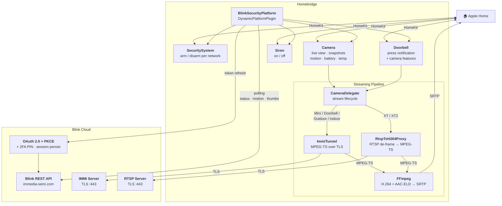

<span align="center">

<h1>
  <a href="https://github.com/BitWise-0x/homebridge-blink-security">
    
  </a>
  <br />
  Homebridge Blink Security
</h1>

[](https://github.com/homebridge/homebridge/wiki/Verified-Plugins)

[](https://www.npmjs.com/package/@jackietreeh0rn/homebridge-blink-security)
[](https://www.npmjs.com/package/@jackietreeh0rn/homebridge-blink-security)
[](https://github.com/BitWise-0x/homebridge-blink-security)
[](https://github.com/BitWise-0x/homebridge-blink-security)
[](https://github.com/BitWise-0x/homebridge-blink-security/pulls)
[](https://github.com/BitWise-0x/homebridge-blink-security/issues)
[](https://app.fossa.com/projects/custom%2B56237%2Fgithub.com%2FBitWise-0x%2Fhomebridge-blink-security?ref=badge_shield&issueType=license)

<!-- [](https://app.fossa.com/projects/git%2Bgithub.com%2FBitWise-0x%2Fhomebridge-blink-security?ref=badge_shield&issueType=security) -->
<br>
The most comprehensive <a href="https://homebridge.io">Homebridge</a> plugin for <a href="https://blinkforhome.com">Amazon Blink</a> cameras, doorbells, and sirens — bringing your Blink devices into <a href="https://www.apple.com/ios/home/">Apple Home</a> with live view, motion detection, snapshots, and arm/disarm.

</span>
<br><br>
<p align="center">
  
  &nbsp;&nbsp;&nbsp;&nbsp;
  
</p>

<br>

## Supported Devices

<div align="center">

| Device                    | Model Type            | Capabilities                                                                                                                                                                                                                    |
| ------------------------- | --------------------- | ------------------------------------------------------------------------------------------------------------------------------------------------------------------------------------------------------------------------------- |
| 📷 Blink Outdoor / Indoor | `default`, `catalina` | <ul><li>Live view (IMMI) + audio</li><li>Motion sensor</li><li>Snapshots</li><li>Temperature</li><li>Battery level</li><li>Night vision</li><li>Clip recording</li><li>Privacy mode</li><li>Motion enable/disable</li></ul>     |
| 📷 Blink XT / XT2         | `white`, `xt`         | <ul><li>Live view (RTSP, video only)</li><li>Motion sensor</li><li>Snapshots</li><li>Temperature</li><li>Battery level</li><li>Night vision</li><li>Clip recording</li><li>Privacy mode</li><li>Motion enable/disable</li></ul> |
| 📸 Blink Mini             | `owl`                 | <ul><li>Live view (IMMI) + audio</li><li>Motion sensor</li><li>Snapshots</li><li>Clip recording</li><li>Privacy mode</li><li>Motion enable/disable</li></ul>                                                                    |
| 📸 Blink Mini 2           | `hawk`                | <ul><li>Live view (IMMI) + audio</li><li>Motion sensor</li><li>Snapshots</li><li>Clip recording</li><li>Privacy mode</li><li>Motion enable/disable</li></ul>                                                                    |
| 🔦 Blink Wired Floodlight | `superior_owl`        | <ul><li>Live view (IMMI) + audio</li><li>Motion sensor</li><li>Snapshots</li><li>Clip recording</li><li>Privacy mode</li><li>Motion enable/disable</li></ul>                                                                    |
| 🚪 Blink Video Doorbell   | `lotus`               | <ul><li>Live view (IMMI) + audio</li><li>Motion sensor</li><li>Snapshots</li><li>Doorbell press notification</li><li>Clip recording</li><li>Privacy mode</li><li>Motion enable/disable</li></ul>                                |
| 🚨 Blink Siren            | siren                 | <ul><li>On/off switch</li></ul>                                                                                                                                                                                                 |

</div>

<br>

## Architecture



<br>

## Features

- **Live view** — IMMI and RTSP streaming via ffmpeg with automatic keepalive (H.264 video, AAC-ELD audio on IMMI cameras)
- **Security system** — Arm/disarm per network, with optional manual arm switch
- **Multi-network** — Supports multiple sync modules, each with independent arm/disarm
- **Motion detection** — Configurable polling interval with debounce
- **Motion enable/disable** — Per-camera switch to turn motion detection on or off
- **Snapshots** — Periodic thumbnail refresh with caching and retry
- **Battery** — Battery level and low-battery alerts (Outdoor/Indoor models)
- **Temperature** — Ambient temperature sensor (Outdoor/Indoor models)
- **Doorbell press** — Push notifications on doorbell button press
- **Privacy mode** — Per-camera switch to suppress snapshots when disarmed
- **Night vision** — IR illuminator toggle (Outdoor/Indoor models)
- **Clip recording** — Trigger a clip recording via momentary switch
- **Live View clip saving** — Configurable per-network `lv_save` toggle to save or suppress Live View clips
- **One-way audio** — Listen-in on IMMI cameras (Mini, Mini 2, Outdoor/Indoor, Doorbell, Floodlight) transcoded to AAC-ELD for HomeKit
- **OAuth 2.0 + PKCE** — Token refresh and persistent sessions across restarts
- **2FA** — One-time PIN verification for Blink's two-factor auth
- **Snapshot fallback** — Streams the last thumbnail when live view is unavailable
- **Stale accessory cleanup** — Removes devices no longer on your Blink account
- **Retry with backoff** — Automatic retry on network errors and rate limiting

<br>

## Installation

[Install Homebridge](https://github.com/homebridge/homebridge/wiki), add it to [Apple Home](https://github.com/homebridge/homebridge/blob/main/README.md#adding-homebridge-to-ios), then install and configure Homebridge Blink Security.

### Recommended

1. Open the [Homebridge UI](https://github.com/homebridge/homebridge/wiki/Install-Homebridge-on-macOS#complete-login-to-the-homebridge-ui).

2. Open the Plugins tab, search for `homebridge-blink-security`, and install the plugin.

3. Configure your Blink credentials through the settings panel.

<p align="center">
  
</p>

<p align="center">
  
</p>

### Manual

1. Install the plugin using NPM:

   ```sh
   npm i -g @jackietreeh0rn/homebridge-blink-security
   ```

2. Configure the BlinkSecurity platform in `~/.homebridge/config.json` as shown in [`config.example.json`](./config.example.json).

3. Start Homebridge:

   ```sh
   homebridge -D
   ```

<br>

## 2FA Setup

Blink requires two-factor authentication on first login:

1. Configure your `username` and `password` and restart Homebridge
2. Blink will send a verification code to your email/phone
3. Add the code to the `pin` field in config and restart Homebridge
4. After successful verification, remove the `pin` field — the session is persisted

<br>

## Configuration

| Property                           | Type    | Default    | Description                                                                                                                                 |
| ---------------------------------- | ------- | ---------- | ------------------------------------------------------------------------------------------------------------------------------------------- |
| `username`                         | string  | _required_ | Blink account email                                                                                                                         |
| `password`                         | string  | _required_ | Blink account password                                                                                                                      |
| `pin`                              | string  |            | 2FA verification code (only needed once)                                                                                                    |
| `hide-alarm`                       | boolean | `false`    | Hide the SecuritySystem accessory                                                                                                           |
| `hide-manual-arm-switch`           | boolean | `false`    | Hide the manual arm/disarm switch                                                                                                           |
| `hide-temperature-sensor`          | boolean | `false`    | Hide temperature sensors on cameras                                                                                                         |
| `hide-enabled-switch`              | boolean | `false`    | Hide motion enabled/disabled switch                                                                                                         |
| `hide-privacy-switch`              | boolean | `false`    | Hide privacy mode switch                                                                                                                    |
| `hide-cameras`                     | boolean | `false`    | Removes cameras from HomeKit. Rooms, automations, scenes, and custom names will not be restored if toggled back off                         |
| `hide-doorbells`                   | boolean | `false`    | Removes doorbells from HomeKit. Rooms, automations, scenes, and custom names will not be restored if toggled back off                       |
| `enable-liveview`                  | boolean | `true`     | Enable IMMI live view streaming                                                                                                             |
| `enable-audio`                     | boolean | `false`    | Enable one-way audio in Live View. Also requires Audio Streaming in the Blink app under Device Settings → Privacy                           |
| `lv-save`                          | boolean | `false`    | Save Live View clips to Blink cloud                                                                                                         |
| `disable-thumbnail-refresh`        | boolean | `false`    | Disable automatic thumbnail refresh                                                                                                         |
| `blink-status-polling-seconds`     | integer | `10`       | Seconds between Blink system refreshes (range 1–300). Default 10. Higher values reduce API load but delay arm/disarm state updates          |
| `camera-thumbnail-refresh-seconds` | integer | `3600`     | Minimum seconds between Blink cloud thumbnail refreshes per camera (HomeKit polls and is served cached thumbnails between refreshes)        |
| `camera-status-polling-seconds`    | integer | `30`       | Camera status polling interval in seconds                                                                                                   |
| `camera-motion-polling-seconds`    | integer | `15`       | Motion detection polling interval in seconds                                                                                                |
| `logging`                          | string  |            | `"quiet"` suppresses routine chatter (thumbnail refresh, reconfigure, clip recording, sleep). `"verbose"` or `"debug"` for extended logging |
| `enable-startup-diagnostic`        | boolean | `false`    | Log diagnostic info on startup                                                                                                              |

<br>

## Development

### Prerequisites

- Node.js 18.20.4+, 20.18.0+, 22.10.0+, or 24.0.0+
- Homebridge 1.8.0+ or 2.0.0-beta+

FFmpeg is bundled via the [`ffmpeg-for-homebridge`](https://github.com/homebridge/ffmpeg-for-homebridge) dependency — no separate install is needed, and it ships with `libfdk_aac` enabled for AAC-ELD audio.

### Setup

```sh
npm install
npm run build
npm link
```

### Watch Mode

Automatically recompiles and restarts Homebridge on source changes:

```sh
npm run watch
```

This runs a local Homebridge instance in debug mode using the config at `./test/hbConfig/`. Stop any other Homebridge instances first to avoid port conflicts. The watch behavior can be adjusted in [`nodemon.json`](./nodemon.json).

### Linting & Formatting

```sh
npm run lint        # check for lint errors
npm run lint:fix    # auto-fix lint errors
npm run prettier    # check formatting
npm run format      # auto-fix formatting
```

Commits must follow [Conventional Commits](https://www.conventionalcommits.org/en/v1.0.0/#summary) — enforced by pre-commit hooks via [commitlint](https://commitlint.js.org/) and [husky](https://typicode.github.io/husky/).

<br>

## Troubleshooting

### No Audio in Live View

One-way audio is supported on IMMI cameras (Mini, Mini 2, Outdoor/Indoor, Doorbell, Wired Floodlight). XT / XT2 cameras use RTSP and are video-only.

Audio is opt-in. To enable it:

1. Set `enable-audio: true` in plugin config
2. Open the Blink app → Device Settings → Privacy → enable Audio Streaming for each camera
3. Restart the child bridge

If Audio Streaming is disabled in the Blink app, the camera sends malformed audio metadata that stalls the stream. That is why audio defaults to off.

### Live View shows "Not responding"

If Live View spins and eventually shows "Not responding" in the Home app, the most common cause is audio being enabled in plugin config while Audio Streaming is disabled in the Blink app for that camera. Either enable Audio Streaming in the Blink app, or set `enable-audio: false` in plugin config.

### VPN Interference

Blink's authentication servers may reject login requests made through a VPN, returning HTTP 406 with no 2FA code sent. If you're unable to complete initial setup:

1. Disconnect your VPN
2. Restart the Homebridge child bridge
3. Complete 2FA verification
4. You can re-enable your VPN after authentication succeeds — sessions are persisted

### General

If you run into issues, check the [Homebridge troubleshooting wiki](https://github.com/homebridge/homebridge/wiki/Basic-Troubleshooting) first. If the problem persists, [open an issue](https://github.com/BitWise-0x/homebridge-blink-security/issues/new/choose) with as much detail as possible.

<br>

## Contributing

See [CONTRIBUTING.md](./CONTRIBUTING.md) for guidelines on bug reports, feature requests, and code contributions.

<br>

## Useful Resources

> **Read the full write-up:** [Homebridge SmartRent & Blink](https://blog.bitwise0x.com/blog/homebridge-smartrent-blink) — an architectural deep-dive into how both plugins map their respective APIs into HomeKit (HAP service composition, IMMI streaming, OAuth/2FA, motion polling).

- [MattTW/BlinkMonitorProtocol](https://github.com/MattTW/BlinkMonitorProtocol) — Blink API documentation
- [fronzbot/blinkpy](https://github.com/fronzbot/blinkpy) — Python Blink library (Home Assistant)
- [Homebridge Developer Documentation](https://developers.homebridge.io/)
- [Apple HomeKit Documentation](https://developer.apple.com/documentation/homekit/)

<br>

## License

[GNU GENERAL PUBLIC LICENSE, Version 3](https://www.gnu.org/licenses/gpl-3.0.en.html)

<!-- [](https://app.fossa.com/projects/custom%2B56237%2Fgithub.com%2FBitWise-0x%2Fhomebridge-blink-security?ref=badge_large&issueType=license) -->

<br>

## Disclaimer

This project is not endorsed by, directly affiliated with, maintained, authorized, or sponsored by Amazon.com, Inc., Immedia Semiconductor, or Apple Inc. All product and company names are the registered trademarks of their original owners. The use of any trade name or trademark is for identification and reference purposes only and does not imply any association with the trademark holder of their product brand.
